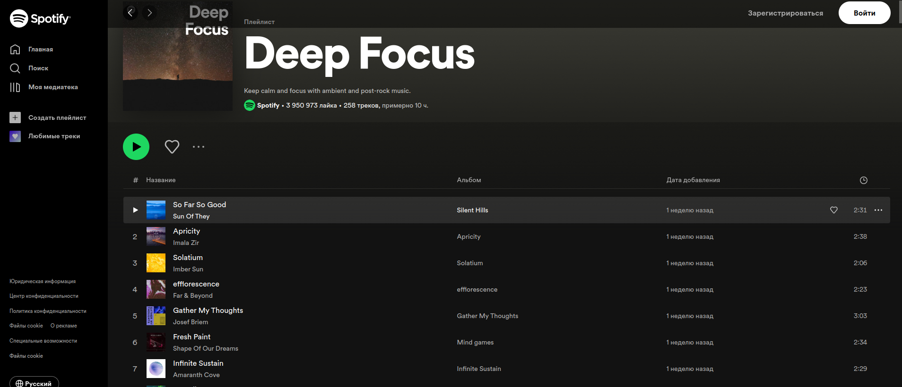

# Music_Playlist

## Музыкальный плейлист

> Это документация для программы, которая сканирует музыку и конвертирует ее в формат JSON, а затем связывает данные JSON с Django. Программа позволяет управлять музыкальными плейлистами, а также предоставляет возможность воспроизведения и паузы для каждой композиции.

**Пример программы так работает как Spotify но дизайна его нет.**

## Установка

**Для установки программы, выполните следующие шаги:**

1. Установите Python на вашу систему, если он еще не установлен. Вы можете скачать Python с официального сайта: https://www.python.org/downloads/

2. Клонируйте репозиторий с программой на вашу локальную машину:
 - **git clone** https://github.com/Humoyun004/Music_Playlist.git

3. Перейдите в директорию с программой:
cd Music_Playlist.git

## Использование

 **Запустите программу с помощью команды:**
 - **python manage.py runserver**

## Дополнительные ресурсы
- **Документация Django:** https://docs.djangoproject.com/

## Заключение
> Эта программа позволяет управлять музыкальными плейлистами, а также предоставляет возможность воспроизведения и паузы для каждой композиции. Следуя инструкциям в этой документации, вы сможете настроить и использовать программу.

